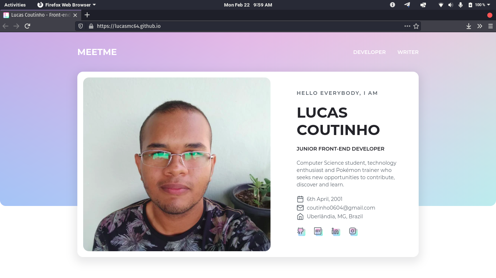

# Contact page :telephone:

> :brazil: Caso prefira ler em outra língua, esse README foi escrito também em português. Clique [AQUI](/README_pt-br.md) para acessar.

## Some details :scroll:

* The front end is made with HTML5, CSS3 and JavaScript.

## How to run the project on my machine? :thinking:

The first step is to clone the project, either via terminal or GitHub Desktop, or even by downloading the compressed file (.zip). After that, go ahead.

### Requirements :hammer_and_wrench:

There are no requirements to run the project on your computer! Just double click on the *index.html* file and it will open in your default browser.

## If everything went well... :tada:

Now you are running the project beautifully!
